<div align="center">

# 旅 Tabi — Japan, Together

**A family of four's first journey through Japan.**
Fourteen days, hand-crafted. Built for iPhone, works offline, beautiful in daylight and lantern-light.

</div>

---

<p align="center">
  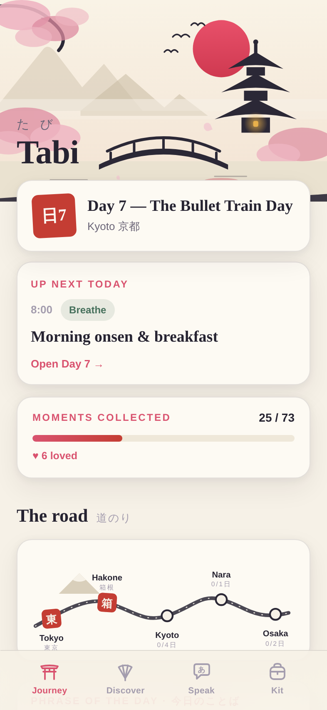
  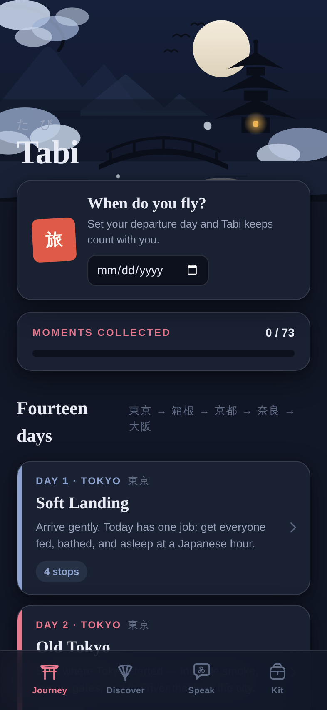
  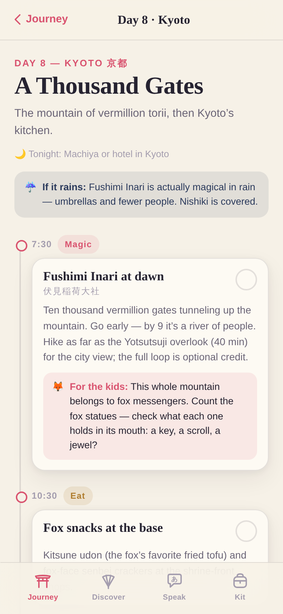
</p>

## Current state

**As of 2026-07-10 — [v3.1.0](https://github.com/xNerveWreck/Fable-s-Japan-App/releases/tag/v3.1.0) shipped** (the repo's first tagged release, built app attached).
`main` carries v2.1 *Kioku*, the v3 *Ikiteiru* core (solar clock, microseasons,
nijimi, living vignettes, Fuji Window), and the trip pack (family voice
phrasebook, Denshadex, Deer Diplomacy, Side Quests v1) — 79-check suite green —
and auto-deploys via the GitHub Pages workflow. **Source of truth:** GitHub
`xNerveWreck/Fable-s-Japan-App`, branch `main`; agents `git fetch` before working
(the owner edits from claude.ai cloud sessions too). **Verify a checkout:**
`npm install`, `npx playwright install chromium`, `npm run build`, `npm run check`
— every check green, no exceptions. Session log: [SESSION_NOTES.md](SESSION_NOTES.md).

## What this is

Tabi (旅, *journey*) is a complete travel companion for a family's first two weeks in Japan — Tokyo → Hakone → Kyoto → Nara → Osaka. It's a React PWA designed exclusively for the iPhone in your pocket on a Kyoto street corner: installable to the Home Screen, fully offline once loaded, no accounts, no servers, no tracking. Everything lives on the device.

### The four tabs

| | |
|---|---|
| ⛩️ **Journey** | The 14-day itinerary as a living record. Every day has a theme, a painted city vignette, a timeline of stops, honest family pacing, a rain plan, a **reservations pocket** for confirmation codes, and 🦊 *For the kids* tips on nearly every activity. Mark each stop **Did it / Loved it / Skipped** — loved moments collect into a treasures list. The home screen carries the countdown (then live *Up next today* during the trip), **The Road** — the route as one brushstroke, where a red hanko stamp lands on each completed city — a rotating phrase of the day, and the **stamp journal**: fourteen eki-stamp badges earned day by day. From any day page, flip through the trip like pages of a scroll — chevrons in the header, painted next/previous cards at the foot. The bullet-train day opens the **Fuji Window** (below); Nara day runs the **Deer Dojo**, a practice round of shika-senbei protocol that becomes a live exchange log with ranks; and every city hides three **Side Quests** — find-it micro-hunts that unlock on arrival, where two finds paint a secret detail into that city's vignette forever. |
| 🪭 **Discover** | A field guide to how Japan works: etiquette (onsen rules, chopstick taboos, the escalator-side rivalry), transit mastery (Suica, Shinkansen, luggage forwarding), practical magic (konbini, vending machines, gachapon), culture keys (shrine vs. temple, omamori) — plus a 20-dish food guide rated on a five-petal **kid-meter**, and the **Train Quiz**: sixteen questions to pass around the shinkansen, scored like an omikuji fortune. Plus the **Denshadex**: ten collectible cards for the rolling stock this exact trip rides — grey ink silhouettes until *乗った! I rode it!* floods them with ink, with rarity dots, spotter facts, and first-ridden dates that sync between the family's phones. |
| 📓 **Kioku Journal** *(v2.1)* | One entry per day — what actually happened — with photos stored on-device in IndexedDB and displayed through a **sumi-e ink filter** (tap any photo to flip between ink and original). **Four travelers** give the family names, animal mascots, and ink colors: journal entries carry their author, the Train Quiz keeps a family leaderboard, and the trip-day counter runs on **Japan time**. A synthesized **sound & haptic grammar** (off by default) gives check-offs a stone tap, loved moments a heartbeat, and completed days the deep thunk of a landing hanko. |
| 💬 **Speak** | A 46-phrase family phrasebook with kana, romaji, and usage notes. Tap the speaker and the phone *says the phrase aloud* in Japanese (on-device speech synthesis, offline). Star your go-to phrases; search across everything. Includes a Kids' Corner — *sugoi!*, *yatta!*, *janken pon!* A brush-red mic beside every speaker records the **family's own attempt** (kept on-device in IndexedDB) — ten years on, the phrasebook still plays their eight-year-old voices trying *oishii!* |
| 🎒 **Kit** | Yen ⇄ USD converter with adjustable rate · daily budget guide · five persistent packing checklists · a **Notes** pad for the trip's margin (locker numbers, gate codes — synced with the family) · a ⚙️ **Settings** pocket behind the gear: departure date and the sound & haptics toggle · a tap-to-build **allergy card** that renders full-screen in written Japanese to show restaurant staff · **Family Sync** — fold the whole trip state into a link, AirDrop it to another phone, and merge additively (no servers; the link *is* the data) · emergency numbers as one-tap calls. |

<p align="center">
  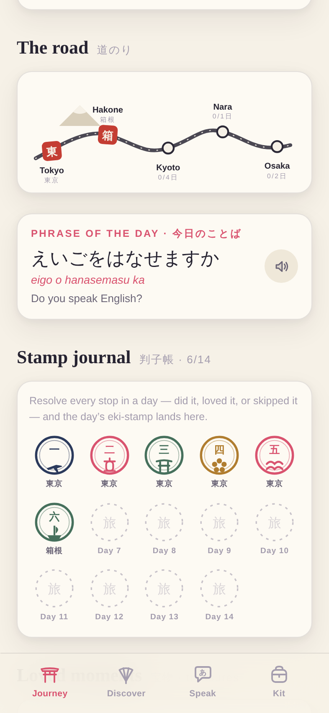
  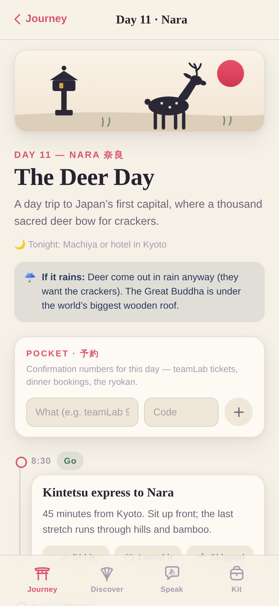
  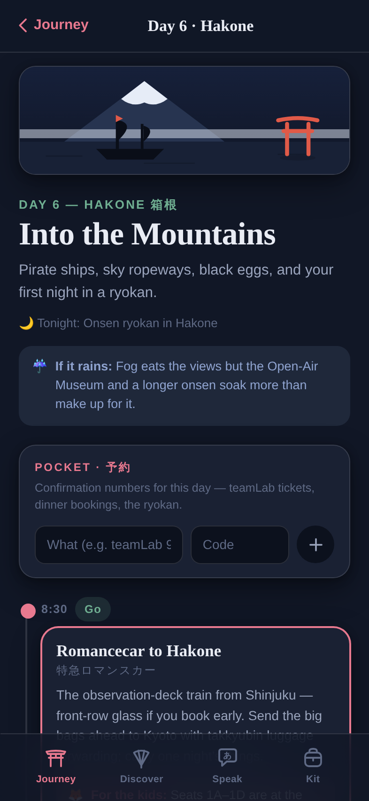
</p>

<p align="center">
  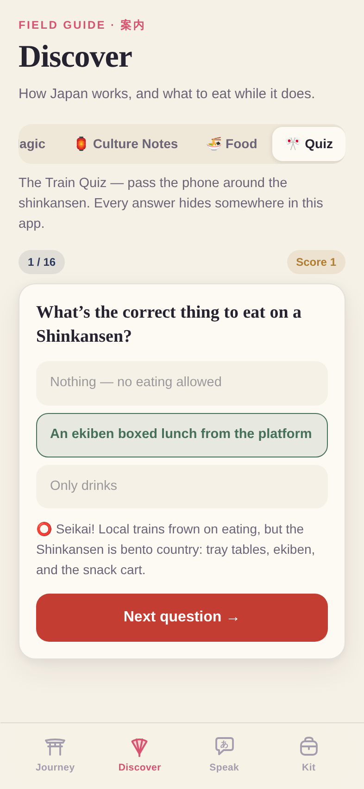
  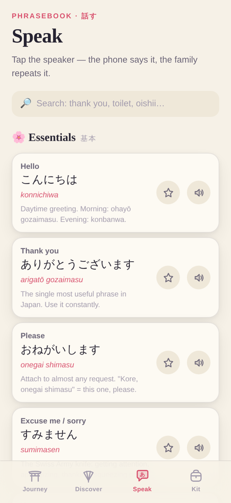
  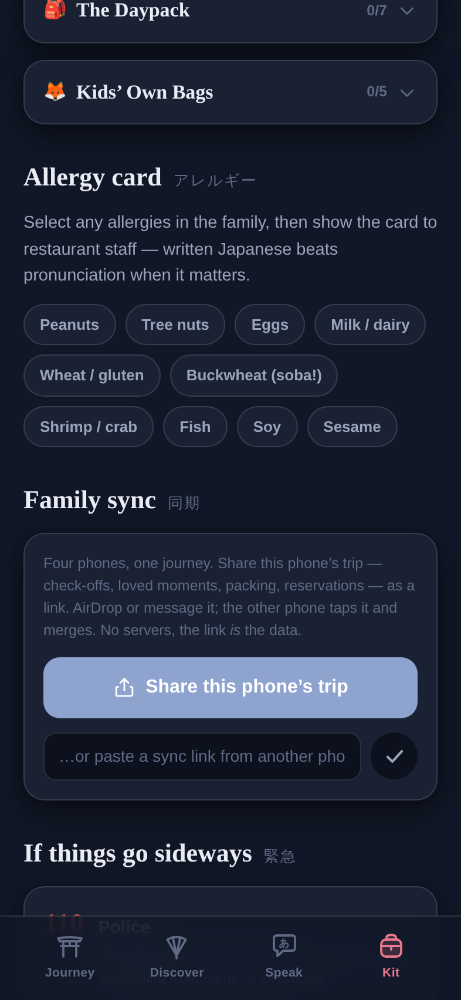
</p>

## The design

The visual language is drawn from sumi-e ink-wash painting and shin-hanga woodblock prints:

- **The solar clock** *(v3)* — the palette no longer flips between day and night; it follows Japan's actual sun, computed on-device with zero network. Asayake pink before sunrise, ink on washi cream at noon, a vermillion yūyake wash at dusk, then the lantern hour and the indigo of Tsuchiya Koitsu's snow prints — the red sun becomes a pale moon, falling sakura petals become falling snow, and a lantern lights up inside the pagoda. During the trip the sky is the *current city's*; before it, Tokyo's. Preview any hour with `?clock=05:00`.
- **72 microseasons** *(v3)* — the classical 七十二候 calendar (five-day seasons, computed offline) brushes the current one down the hero in vertical calligraphy — 温風至, *"Warm winds arrive."* The family learns Japan has seventy-two seasons, not four.
- **Nijimi ink physics** *(v3)* — screens arrive as one wet brushstroke wiping across the paper, and marking a moment blooms wet ink at your fingertip, bled through a shared SVG nijimi filter.
- **Living vignettes** *(v3)* — the city paintings are inhabited. Each is layered into depth planes that tilt with the phone like looking into a diorama (first tap on a painting asks iOS for motion access; without it the planes drift on their own, unrolling like an emakimono). A heron crosses the Kyoto sky every few minutes, the Hakone ropeway gondola inches up its cable, the Nara deer bows, Osaka's neon flickers on after sunset and Tokyo's windows light one by one — every city on its own rhythm, everything still pure CSS on the same solar palette, and `prefers-reduced-motion` stills the whole painting.
- **Fuji Window** *(v3)* — on the bullet-train day the app unrolls a painted Tōkaidō emakimono: tap *Begin the watch* as you board and on-device GPS walks a hanko-red train dot down the scroll, past Odawara and the Hakone hills, counting down to the real geometric moment — *"Fuji on the right in ~4 min"* — then **いまだ — LOOK RIGHT** as the mountain blooms across the painting in three washes, exactly as it fills the actual window (Fuji rides on the right heading west). Tunnels that eat the signal get their own patient status; no GPS at all leaves a painted map of the route. Fully offline — position needs no network. Preview the ride with `?ride=0.28`.

<p align="center">
  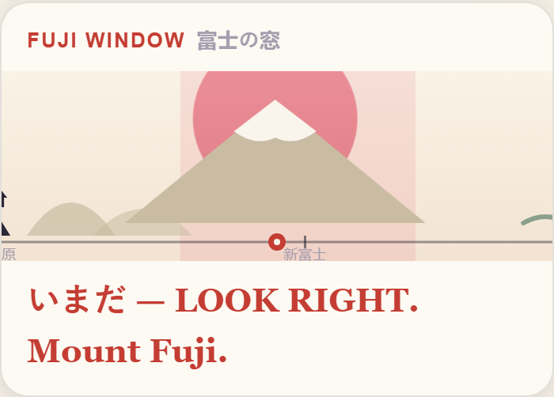
</p>

<p align="center">
  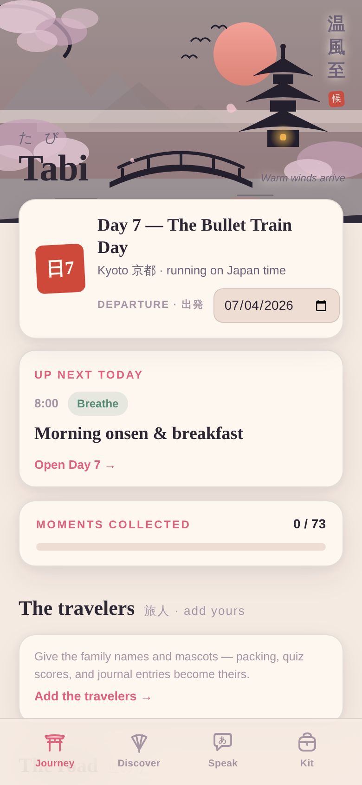
  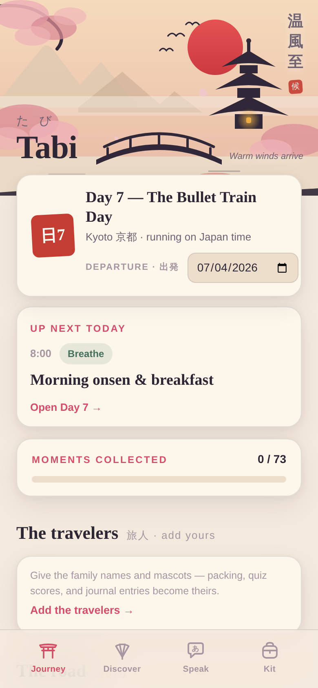
  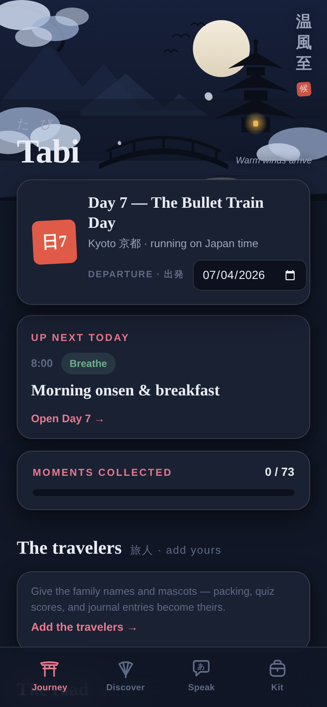
  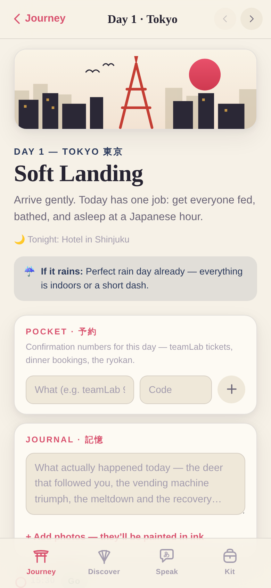
</p>

All the artwork — the hero landscape, six city vignettes (Tokyo Tower, Fuji over Lake Ashi, the Fushimi torii tunnel, a Nara deer, the Dōtonbori crab, the flight home), the brushstroke route map, and fourteen eki-stamp badges — is hand-composed inline SVG. Every color is a CSS custom property, so *one set of brushwork* renders every hour of the sky. No image assets, no web fonts, no external requests of any kind: the display type is New York / Hiragino Mincho straight off iOS.

Details that matter on a real trip: hash routing so iOS edge-swipe back and pull-to-refresh behave like a native app (days are deep-linkable, too), safe-area-aware layout for the notch and home indicator, frosted-glass tab bar, spring-press animations, `prefers-reduced-motion` respected, and a service worker that caches the whole app — because the moment you need the allergy card is not the moment to have signal.

## Where it goes next

The full unconstrained vision — from a sound-and-haptics pass to an AI ink-fox companion, printed heirloom
scrolls, and an e-ink tamagotchi pendant — lives in **[ROADMAP.md](ROADMAP.md)**: ~117 ideas from an
eight-lens brainstorm, deduplicated, tiered, and sequenced from v2.1 to v5.

The working method that produced both the app and its roadmap — build inside one declared constraint, then
deliberately dissolve it — is written up in **[PROCESS.md](PROCESS.md)**, with the six questions to ask on
the next project.

## Run it

```bash
npm install
npm run dev        # local dev
npm run build      # production build → dist/
npm run preview    # serve the build
npm run check      # the story suite: drives the build in a phone-sized browser
```

Open on an iPhone (or any browser at iPhone width), then **Share → Add to Home Screen** for the full standalone experience.

**Deploying:** a GitHub Pages workflow ships with the repo — enable it once under *Settings → Pages →
Source: GitHub Actions*, and every push to `main` deploys automatically. Append **`?demo=1`** to any
Tabi URL to open a lived-in trip (Day 7, six stamps earned, travelers named) instead of an empty state —
empty states hide magic.

## Stack

React 18 + TypeScript + Vite. No UI libraries, no CSS frameworks, no runtime dependencies beyond React — the entire app is ~99 KB gzipped, MIT licensed. Verified with the committed story suite ([`tests/story.mjs`](tests/story.mjs), `npm run check`): 38 checks at iPhone viewport that walk the real narratives — set a departure date and correct it, flip between days, watch the palette cross five solar phases without ever losing paper/ink contrast, bloom ink on a loved moment.

---

<div align="center">

*Built end-to-end — concept, itinerary, artwork, design system, and code — by Claude.*

いってらっしゃい — safe travels. 🌸

</div>
