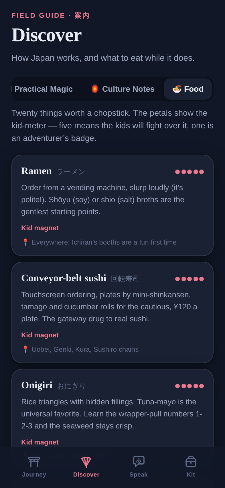
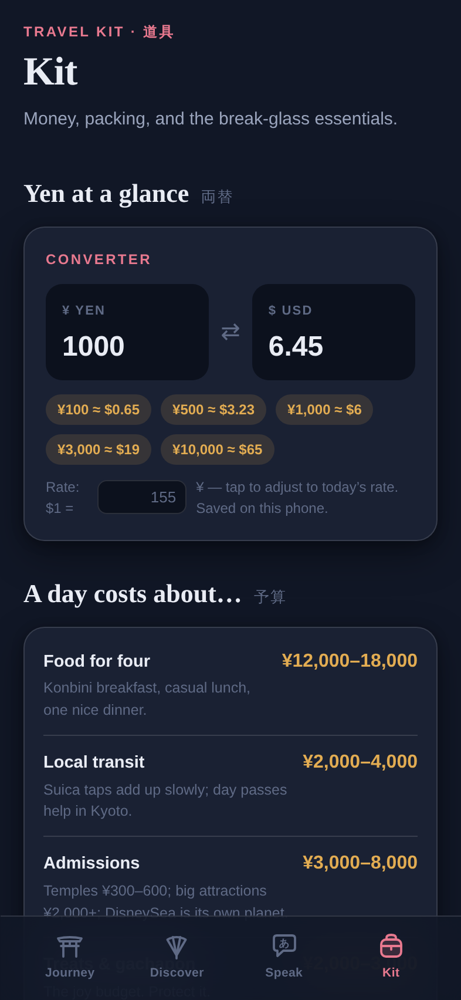

<div align="center">

# 旅 Tabi — Japan, Together

**A family of four's first journey through Japan.**
Fourteen days, hand-crafted. Built for iPhone, works offline, beautiful in daylight and lantern-light.

</div>

---

<p align="center">
  
  
  
</p>

## What this is

Tabi (旅, *journey*) is a complete travel companion for a family's first two weeks in Japan — Tokyo → Hakone → Kyoto → Nara → Osaka. It's a React PWA designed exclusively for the iPhone in your pocket on a Kyoto street corner: installable to the Home Screen, fully offline once loaded, no accounts, no servers, no tracking. Everything lives on the device.

### The four tabs

| | |
|---|---|
| ⛩️ **Journey** | The 14-day itinerary as a living checklist. Every day has a theme, a timeline of stops with times, honest family pacing, a rain plan, and 🦊 *For the kids* tips on nearly every activity. Set your departure date and the app counts down, then tracks which day of the trip you're on. Check off moments as you collect them. |
| 🪭 **Discover** | A field guide to how Japan works: etiquette (onsen rules, chopstick taboos, the escalator-side rivalry), transit mastery (Suica, Shinkansen, luggage forwarding), practical magic (konbini, vending machines, gachapon), culture keys (shrine vs. temple, omamori) — plus a 20-dish food guide rated on a five-petal **kid-meter**. |
| 💬 **Speak** | A 46-phrase family phrasebook with kana, romaji, and usage notes. Tap the speaker and the phone *says the phrase aloud* in Japanese (on-device speech synthesis, offline). Star your go-to phrases; search across everything. Includes a Kids' Corner — *sugoi!*, *yatta!*, *janken pon!* |
| 🎒 **Kit** | Yen ⇄ USD converter with adjustable rate and at-a-glance chips · daily budget guide · five packing checklists that persist between sessions · a tap-to-build **allergy card** that renders full-screen in written Japanese to show restaurant staff · emergency numbers as one-tap calls. |

<p align="center">
  
  
  
</p>

## The design

The visual language is drawn from sumi-e ink-wash painting and shin-hanga woodblock prints:

- **Day** — ink on washi-paper cream, sakura pink and vermillion accents, a red hanko seal for the day counter.
- **Night** — the palette shifts to the indigo of Tsuchiya Koitsu's snow prints: the red sun becomes a pale moon, falling sakura petals become falling snow, and a lantern lights up inside the pagoda.

The hero landscape is hand-composed inline SVG — every color is a CSS custom property, so *one painting* renders both scenes. No image assets, no web fonts, no external requests of any kind: the display type is New York / Hiragino Mincho straight off iOS.

Details that matter on a real trip: safe-area-aware layout for the notch and home indicator, frosted-glass tab bar, spring-press animations, `prefers-reduced-motion` respected, and a service worker that caches the whole app — because the moment you need the allergy card is not the moment to have signal.

## Run it

```bash
npm install
npm run dev        # local dev
npm run build      # production build → dist/
npm run preview    # serve the build
```

Open on an iPhone (or any browser at iPhone width), then **Share → Add to Home Screen** for the full standalone experience.

## Stack

React 18 + TypeScript + Vite. No UI libraries, no CSS frameworks, no runtime dependencies beyond React — the entire app is ~76 KB gzipped.

---

<div align="center">

*Built end-to-end — concept, itinerary, artwork, design system, and code — by Claude.*

いってらっしゃい — safe travels. 🌸

</div>
